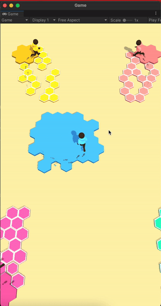
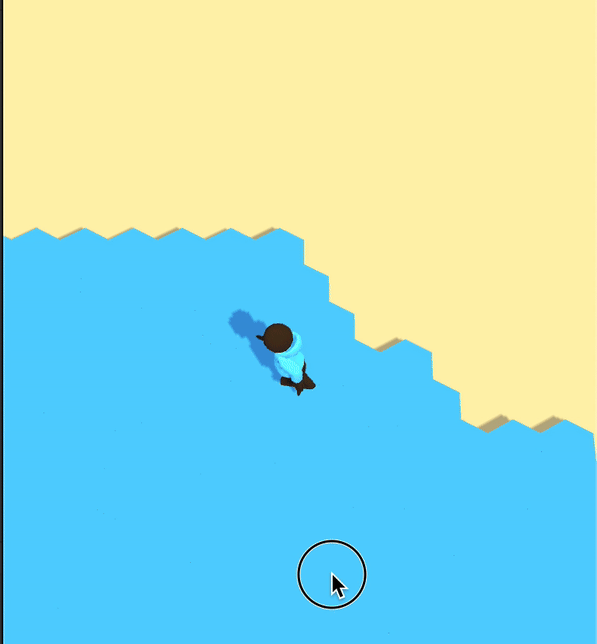

# Game Development Progress

### Overview
I started developing this game just for fun, as a **copy experiment** of the original game **LandRush.io** by **Supercent**. I really liked their work, and this project is all about curiosity and exploring new ideas. As a developer, I find it easier to work with a predefined game design, which allows me to focus on coding, instead of spending time on game design. I’ll keep improving the game if I have more time.
Here’s what I've done so far and the challenges I faced.

### Development Progress
- **Day 1:**
  - Set up the project.
  - Built the basic game mechanics and controls.
  - Started working on a hexagonal grid system for the game world.
  
- **Day 2:**
  - Improved the hex grid system.
  - Tried filling areas in the grid (this part still has some bugs).
  - Worked on player movement and interaction with the grid.
  - Added basic AI bot control and behavior (still needs improvement).

### Challenges
1. **Hex Grid Shaping and Filling:**
   - The biggest challenge was shaping and filling areas on the hex grid. I first tried using **flood fill** algorithm, but it didn’t work well because the player movement is more complex.
   - So, I started working on a new algorithm that fits better.
   - The hex grid filling system still has some bugs that will be fixed in future commits.
  

2. **AI Bots:**
   - AI bot control and behavior are still basic and need improvement. Currently, the bots follow simple paths and actions. I plan to refine their behavior, making them more dynamic and responsive to the player's actions.

3. **Performance Improvements:**
   - As the game grows, improving performance will be key. I'm considering using **compute shaders** to speed up certain parts of the game, especially for things like handling the hex grid calculations. This should help a lot with keeping the game running smoothly as more features are added.

### Future Plans
If I have more time, I will keep improving the game:
- Fixing the hex grid bugs.
- Adding better AI behavior for bots.
- Optimizing performance using compute shaders.
- Adding new features and polishing the existing mechanics.

Feel free to follow the progress and provide any feedback or suggestions!
